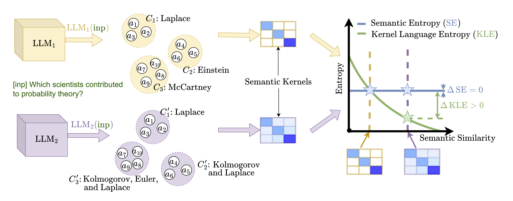

# Kernel Language Entropy: <br> Fine-grained Uncertainty Quantification for LLMs

This repository is the official implementation of the methods in the publication [Kernel Language Entropy: Fine-grained Uncertainty Quantification for LLMs from Semantic Similarities (NeurIPS'24)](https://arxiv.org/abs/2405.20003).


<div align="center">

</div>

This code builds on [Semantic Uncertainty codebase](https://github.com/jlko/semantic_uncertainty/tree/master).

KLE and utils around it are in the `./kle/` folder. The rest of the codebase is similar to the original one but additionally evaluates KLE with various hyperparameters.

## System Requirements

We here discuss hardware and software system requirements.

### Hardware Dependencies

Generally speaking, our experiments require modern computer hardware which is suited for usage with large language models (LLMs).

Requirements regarding the system's CPU and RAM size are relatively modest: any reasonably modern system should suffice, e.g. a system with an Intel 10th generation CPU and 16 GB of system memory or better.

More importantly, all our experiments make use of one or more Graphics Processor Units (GPUs) to speed up LLM inference.
Without a GPU, it is not feasible to reproduce our results in a reasonable amount of time.
The particular GPU necessary depends on the choice of LLM: LLMs with more parameters require GPUs with more memory.
For smaller models (7B parameters), desktop GPUs such as the Nvidia TitanRTX (24 GB) are sufficient.
For larger models (13B), GPUs with more memory, such as the Nvidia A100 server GPU, are required.
Our largest models with 70B parameters require the use of two Nvidia A100 GPUs (2x80GB) simultaneously.

One can reduce the precision to float16 or int8 to reduce memory requirements without significantly affecting model predictions and their accuracy.
We use float16 for 70B models by default, and int8 mode can be enabled for any model by suffixing the model name with `-int8`.


### Software Dependencies
Our code relies on Python 3.11 with PyTorch 2.1.

Our systems run the Ubuntu 20.04.6 LTS (GNU/Linux 5.15.0-89-generic x86_64) operating system.

In [environment_export.yaml](environment_export.yaml) we list the exact versions for all Python packages used in our experiments.
We generally advise against trying to install from this exact export of our conda environment.
Please see below for installation instructions.

Although we have not tested this, we would expect our code to be compatible with other operating systems, Python versions, and versions of the Python libraries that we use.


## Installation Guide


To install Python with all necessary dependencies, we recommend the use of conda, and we refer to [https://conda.io/](https://conda.io/) for an installation guide.


After installing conda, you can set up and activate a new conda environment with all required packages by executing the following commands from the root folder of this repository in a shell:


```
conda-env update -f environment.yaml
conda activate kernel_language_entropy
pip install --upgrade scipy networkx loguru
pip install -e .
```

Our experiments rely on [Weights & Biases (wandb)](https://wandb.ai/) to log and save individual runs.
While wandb will be installed automatically with the above conda script, you may need to log in with your wandb API key upon initial execution.

In order to setup `wandb`, run:
```bash
wandb init
```

Our experiments rely on Hugging Face for all LLM models and most of the datasets.
It may be necessary to set the environment variable `HUGGING_FACE_HUB_TOKEN` to the token associated with your Hugging Face account.
Further, it may be necessary to [apply for access](https://huggingface.co/meta-llama) to use the official repository of Meta's LLaMa-2 models.
We further recommend setting the `XDG_CACHE_HOME` environment variable to a directory on a device with sufficient space, as models and datasets will be downloaded to this folder.


Our experiments can use GPT models from the OpenAI API.
Please set the environment variable `OPENAI_API_KEY` amd `OPENAI_API_URL` to your OpenAI API key in order to use these models.
Note that OpenAI charges a cost per input token and per generated token.


For almost all tasks, the dataset is downloaded automatically from the Hugging Face Datasets library upon first execution.
The only exception is BioASQ (task b, BioASQ11, 2023), for which the data needs to be [downloaded](http://participants-area.bioasq.org/datasets) manually and stored at `$SCRATCH_DIR/$USER/semantic_uncertainty/data/bioasq/training11b.json`, where `$SCRATCH_DIR` defaults to `.`.


### Reproducing the Experiments

To reproduce the experiments of the paper, one needs to execute
```
python generate_answers.py --num_samples=500 --num_test_samples=400 --model_name=$MODEL --dataset=$DATASET $EXTRA_CFG
```

for all combinations of models and datasets, and where `$EXTRA_CFG` is defined to either activate short-phrase or sentence-length generations and their associated hyperparameters.

Concretely,
* `$MODEL` is one of: `[Llama-2-7b, Llama-2-13b, Llama-2-70b, Llama-2-7b-chat, Llama-2-13b-chat, Llama-2-70b-chat, falcon-7b, falcon-40b, falcon-7b-instruct, falcon-40b-instruct, Mistral-7B-v0.1, Mistral-7B-Instruct-v0.1]`,
* `$DATASET` is one of `[trivia_qa, squad, bioasq, nq, svamp]`,
* and `$EXTRA_CFG=''` is empty for short-phrase generations and `EXTRA_CFG=--num_few_shot=0 --model_max_new_tokens=100 --brief_prompt=chat --metric=llm --metric_model=Meta-Llama-3-8B-Instruct --no-compute_accuracy_at_all_temps` for sentence-length generations.


## Citation
If you use the code in this repository for your research, please cite the paper as follows:

```bibtex
@article{nikitin2024kernel,
  title={Kernel Language Entropy: Fine-grained Uncertainty Quantification for LLMs from Semantic Similarities},
  author={Nikitin, Alexander and Kossen, Jannik and Gal, Yarin and Marttinen, Pekka},
  journal={arXiv preprint arXiv:2405.20003},
  year={2024}
}
```

## Contributing
For all correspondence, please contact alexander.nikitin@aalto.fi.

